# Maxima.ai - Image Alt Text Audit (Detailed)

**Date:** April 14, 2026
**Site:** [https://www.maxima.ai](https://www.maxima.ai)
**Data sources:** Ahrefs Site Audit export + raw HTML extraction from all 30 pages
**Total images missing alt text:** 170+ instances across 30 pages (83 unique images)

---

## Table of Contents

1. [Shared Site-Wide Images (Fix Once, Fix Everywhere)](#1-shared-site-wide-images)
2. [Page-by-Page Image Audit](#2-page-by-page-image-audit)
3. [Summary & Priority](#3-summary--priority)

---

## 1. Shared Site-Wide Images

These images appear on every page (or nearly every page) via Framer's global header/footer/nav components. **Fixing these in Framer will resolve the issue across all 30 pages at once.**

### Images confirmed on ALL 30 pages (via header/footer):

`**Sfz6mVl5Wq1Zdym07lodksvCE.png`** (1920x1080) -- Footer background / decorative gradient

- **Current Alt:** MISSING
- **Suggested Alt:** `""` (empty alt -- decorative)
- **Status:** Updated alt tag to "3D blue cubes illustrating AI-powered accounting accuracy"

---

`**vl8RF4iXhvG4IFYwq1fc6JhmF2c.png`** (5118x2879) -- Full-width decorative background (responsive variants)

- **Current Alt:** MISSING
- **Suggested Alt:** `""` (empty alt -- decorative)
- **Status:** Identified. Not able to find it in Framer.

---

### Ahrefs-flagged images NOT actually visible on site:

`**oSCs67tz1q007qoOCmTmCOUzLvU.png`** -- Ahrefs said all 30 pages, but only exists on `/blog`

- **Reality:** Only exists on `/blog` page in raw HTML. Framer rendering artifact from April 9 crawl.
- **Action:** Low priority -- only affects 1 page

---

`**JEiyjUqswVbHLA4wnNdJYRZMTFQ.png`** -- Only renders at viewport 1906-2486px (ultra-wide)
JEiyjUqswVbHLA4wnNdJYRZMTFQ.png

- **Reality:** Present in HTML on all pages but only for ultra-wide monitors. Framer responsive variant.
- **Action:** Low priority -- not visible to most users

---

### Images appearing on 6+ core pages:

`**JVFEzfu6Sw8C2ZRuuYT19mjzI0.png`** -- Hero/section background on /how-it-works, /careers, /about, /product-overview, /security

- **Current Alt:** MISSING
- **Status:** Identified. Not able to find it in Framer.

---

### Images appearing on most article pages:

`**w4qDXkV1aaFbj3Sqhn4VzNrD0B0.png`** -- Article template shared image (13 article pages)

- **Current Alt:** MISSING
- **Suggested Alt:** "Maxima logo icon" (blue mountain/M shape)
- **Status:** Identified

---

`**iW3LdIyUUysMh7pga9J8nbZx70.png`** -- Article author headshot or shared illustration (CFO 2030, Accuracy, AI tools articles)

- **Current Alt:** MISSING
- **Status:** Identified. Updated the alt tag to "Maxima AI blog post header"

---

### Blog preview images appearing on most pages (via "The Latest" section):

These already have alt text -- no action needed.

`**s3Y06HhlX7Qf6uWWLCHfLzNo.jpg`** -- OK
`**uMCRztucVWslYHQ562XjaSiUtc.jpg**` -- OK

**Impact of fixing shared images:** Fixing the 2 confirmed site-wide images (`Sfz6mVl5Wq1Zdym07lodksvCE.png` and `vl8RF4iXhvG4IFYwq1fc6JhmF2c.png`) eliminates ~60 missing-alt instances across the site. The other 2 images Ahrefs flagged as site-wide (`oSCs67tz` and `JEiyjUq`) are Framer responsive artifacts -- not actually visible to users at normal screen sizes.

---

## 2. Page-by-Page Image Audit

For each page below, images are listed in the order they appear. Shared site-wide images (covered in Section 1) are noted but not repeated in detail.

---

### Homepage (`/`)

**Total images:** 22 unique | **Missing alt:** 5 | **With alt:** 17

**Issues to fix on this page:** 2 customer logos missing alt + 2 alt text typos (Ripping -> Rippling, SpotOn.png -> SpotOn)

#### Missing alt:

`**mI3M74ioo3PzJxjmiwybXMRKg.png`** -- Customer logo (1772x756)
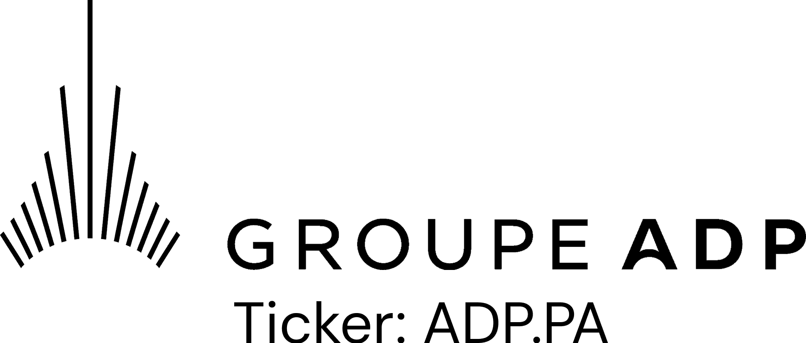

- **Suggested Alt:** "Groupe ADP logo"
- **Status:** Identified

---

`**aNadLCO7oIVRXVvqymeSiWwHrg.png`** -- Customer logo (1392x401)

- **Suggested Alt:** "Owl Labs logo"
- **Status:** Identified

---

#### Alt text typos to fix:

`**2xO5dPLiVpqVAWReKw5iab9Cl8.png`** -- Testimonial headshot

- **Current Alt:** "Vipin Sethi, Controller at **Ripping**"
- **Fix to:** "Vipin Sethi, Controller at **Rippling**"

---

`**bueD7XevgiYiqgzab1SBd6kaRsQ.png`** -- Testimonial headshot
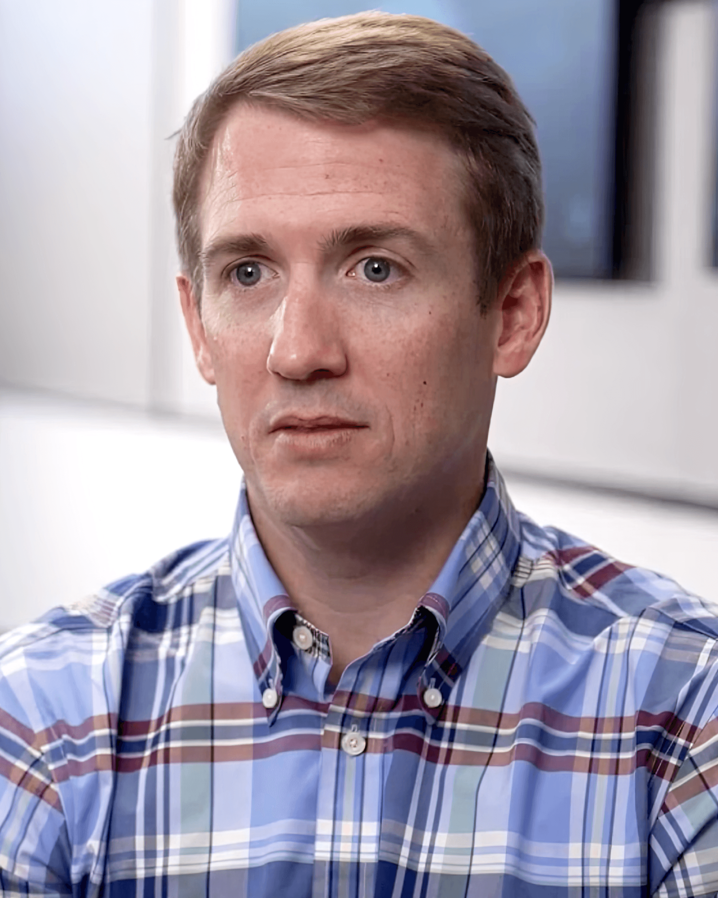

- **Current Alt:** "Jack Chalfant, Controller, SpotOn**.png**"
- **Fix to:** "Jack Chalfant, Controller, SpotOn"

---

### About (`/about`)

**Total images:** 37 unique | **Missing alt:** 34 | **With alt:** 3

This page has 30 team member headshots, all missing alt text. The headshots are 832x832 px square images.

**Note:** The headshot-to-name mapping below is based on alphabetical order of team members shown on the page. **Verify each mapping visually in Framer** before applying, as the rendering order may differ.

#### Co-founders group photo (has alt -- OK):

`**Hyy4c91Au1c49qKCKhJjUMbBnu4.png`** -- Co-founders group photo

- **Current Alt:** "Maxima co-founders Yogi Goel (CEO), Akshaya Srivatsa (CPO), and Jack Liao (CTO)." -- OK

#### Team headshots (all missing alt):

| #   | Preview | Framer Filename                   | Suggested Alt Text                            |
| --- | ------- | --------------------------------- | --------------------------------------------- |
| 1   | 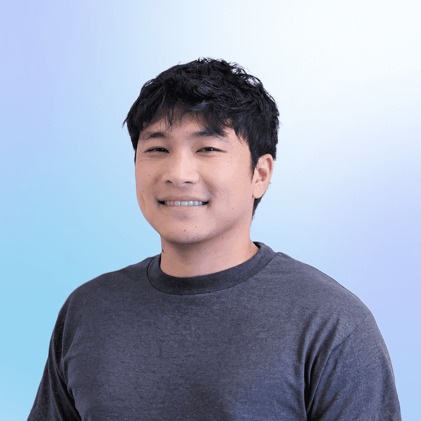 | `5HtYALpXnnTQ71W59GG0DI5G6g.png`  | "Aaron Ko, Software Engineer at Maxima"       |
| 2   |  | `gdptJjSKG515QhOiz5DvIBZff3s.png` | "Abby He, Software Engineer at Maxima"        |
| 3   |  | `tB4YAfEWM1rteItSU5FvHerQLw.png`  | "Akshaya Srivatsa, CPO & Cofounder at Maxima" |
| 4   |  | `fw8okcjTn9ejWhaCgOLipMSY3kg.png` | "Anna Hsiao, Product Design at Maxima"        |
| 5   |  | `S5gggwHeKzsJulyeIjRtRvIvg3s.png` | "Darshit Doshi, Software Engineer at Maxima"  |
| 6   |  | `tkXxpHSLhUcyObJFeCCYKQXxI.png`   | "Jack Liao, CTO & Cofounder at Maxima"        |
| 7   |  | `BmHUd1EcZsnt6GHFRzjLUgFOKGA.png` | "Jacob Tuffli, Enterprise Sales at Maxima"    |
| 8   |  | `DZgJAp7BEEQGIj6mtMbGejkPmw.png`  | "Jake Eagle, Enterprise Sales at Maxima"      |
| 9   |  | `bHr2dpXr7tBuIOECVHRXa8EfUA.png`  | "James Varga, Enterprise Sales at Maxima"     |
| 10  |  | `sIWUoe0IM2EmroxonmKtie3I0YY.png` | "Justin Gu, Software Engineer at Maxima"      |
| 11  |  | `f2hWUTOT1fT1Rgwxixbo3np1WE.png`  | "Kayla Kwon, Software Engineer at Maxima"     |
| 12  |  | `Vz8PqYnHqDGyv7EMzmJPHNjAc.png`   | "Kyle Mook, Enterprise Sales at Maxima"       |
| 13  |  | `WmybgkQNLrF7IyBoAg1MRtHxRE.png`  | "Laura Hendrix, Enterprise Sales at Maxima"   |
| 14  |  | `r7lIwtpt82p7V8GH3XPJkaKS8.png`   | "Mark Ma, Software Engineer at Maxima"        |
| 15  |  | `iDxHlo4RXdVOtJKwtORH6Qtuys.png`  | "Milo Becker, HR at Maxima"                   |
| 16  |  | `lX0ffBivcB1J4ijb0qb7LBpZ0.png`   | "Olivia Gilmour, Enterprise Sales at Maxima"  |
| 17  |  | `zzYk78agza2Krm5El7HJ3swNA.png`   | "Parisa Morris, Enterprise Sales at Maxima"   |
| 18  |  | `Ap378bOOARfP7YErNDCV9RWdkxw.png` | "Pav Kang, Enterprise Sales at Maxima"        |
| 19  |  | `oGlRVxzTI9bfSkxoso1d06s87zY.png` | "Raniz Bordoloi, Marketing at Maxima"         |
| 20  |  | `A9XsAuXVtopTadD2YPZJdAkbc0.png`  | "Reed Mitteness, Enterprise Sales at Maxima"  |
| 21  |  | `0rT9GKetjF82Gqp1ou4EWLSpw0.png`  | "Rundong Lyu, Software Engineer at Maxima"    |
| 22  |  | `b5eaKCdNdS42bwsgrXt5cjCQCQ.png`  | "Sean Park, Enterprise Sales at Maxima"       |
| 23  |  | `yKyI2XNMer111tXBc1ywWxMnP8A.png` | "Shawn Bunch, Enterprise Sales at Maxima"     |
| 24  |  | `eAnZt8ZCt642VcHddUEwF8pK1ZU.png` | "Shawn Shen, Deployment Strategy at Maxima"   |
| 25  |  | `J5bytvQQtdNJA6kw8nMmNgCiBa8.png` | "Skip Kovar, Enterprise Sales at Maxima"      |
| 26  | 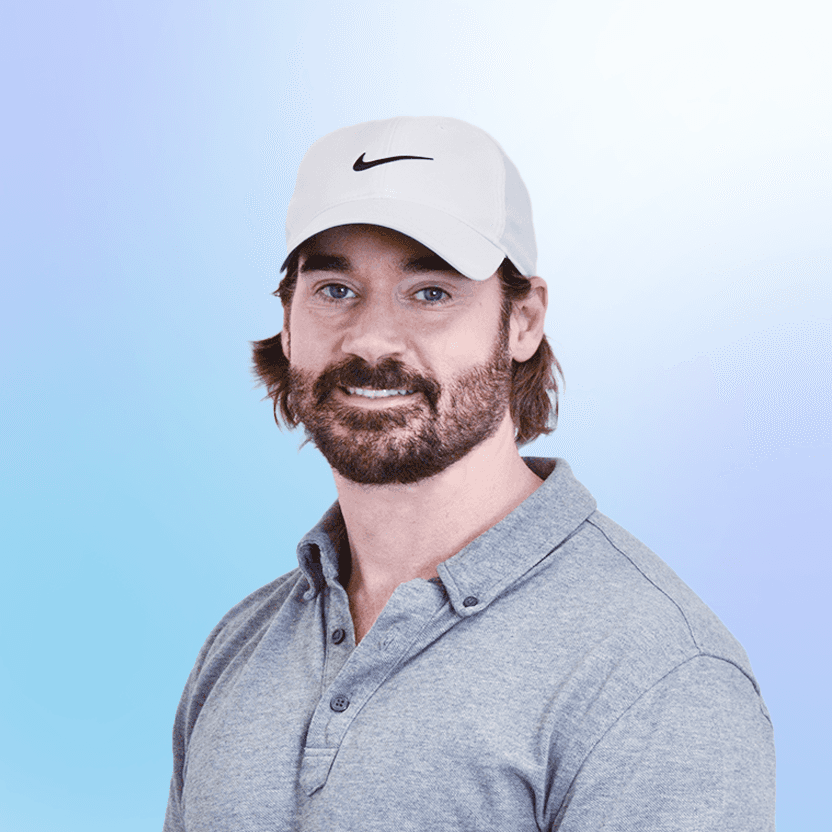 | `UB6Er6PgtXYWMgFvleEO1fshC8.png`  | "Taylor Bauer, Enterprise Sales at Maxima"    |
| 27  |  | `POxfJz2aHqtVW2zyJGJaB7VnU9s.png` | "Terence Wong, Software Engineer at Maxima"   |
| 28  |  | `xNtfJKiiTNTxN4ul5klerhfdA.png`   | "Xiao Xi, Software Engineer at Maxima"        |
| 29  |  | `aK6NdacTnbw3Y96mpbTe7WuV8.png`   | "Yogi Goel, CEO & Cofounder at Maxima"        |
| 30  | 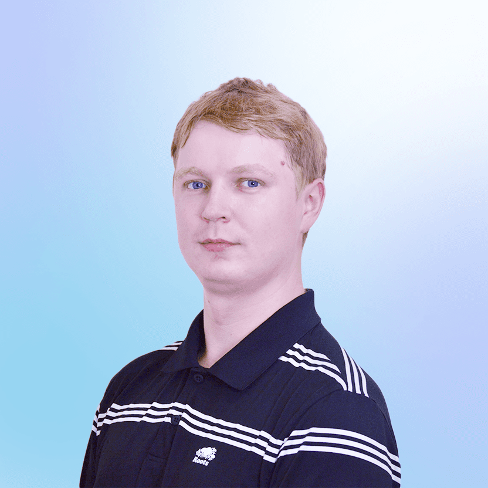 | `to9I1IQ7TvCPsbII1kIlXUhVQs.png`  | "Zack Mitkin, Software Development at Maxima" |

---

### Blog (`/blog`)

**Total images:** ~15 | **Missing alt:** 7 (4 blog-specific + 3 site-wide shared) | **With alt:** ~8

> **Note:** Ahrefs reports 7 missing-alt images on this page. 3 of those are site-wide shared images already covered above: `Sfz6mVl5Wq1Zdym07lodksvCE.png` (footer background), `vl8RF4iXhvG4IFYwq1fc6JhmF2c.png` (decorative background), and `oSCs67tz1q007qoOCmTmCOUzLvU.png` (Framer rendering artifact). The 4 blog-specific thumbnails are listed below.

| #   | Preview | Framer Filename                   | Fixed Alt Text                                                                  |
| --- | ------- | --------------------------------- | ----------------------------------------------------------------------------------- |
| 1   |  | `7Megt5YYEEUMfEwmCgM9HZPFI9k.png` | "Reconciliations in accounting: the definitive guide"                 |
| 2   |  | `OMTw88vPFqJzaiaSmbYqndjFGU.png`  | "7 best financial close software solutions to evaluate in 2026"       |
| 3   | 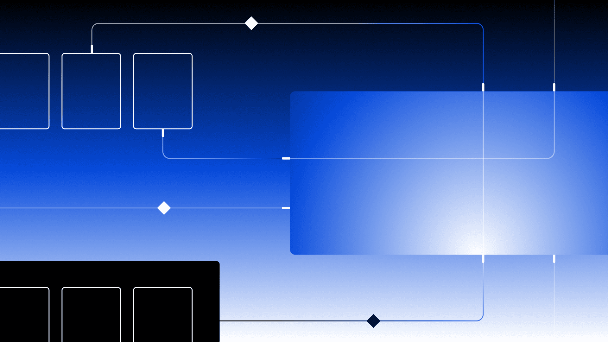 | `PTvcVBayFg0cqO5C2sDLc5KD8.png`   | "AI tools for accounting: best software, categories, and buyer guide" |
| 4   |  | `iee3e1EfvQdYNE5a9EhBmAIfgpo.png` | "Variance analysis: the definitive guide to explaining the numbers"   |

---

### Newsroom (`/newsroom`)

**Total images:** ~12 | **Missing alt:** 9 | **With alt:** 3

| #   | Preview | Framer Filename                   | Suggested Alt Text                  |
| --- | ------- | --------------------------------- | ----------------------------------- |
| 1   |  | `ED3hsTQ3LEeIySbLRVlbGg0dSd4.png` | "TBPN logo"                         |
| 2   |  | `9H3yHdrmyxt1xPG0X0L4ZnwChTg.png` | "FintechTV Exponential Voices logo" |
| 3   | 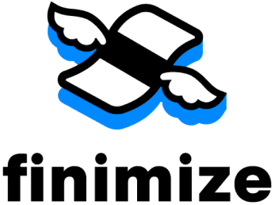 | `aD3QabVBTs47OgmXph0lxmiKgeg.png` | "Finimize logo"                     |
| 4   |  | `dbBES67ciKLqTaakFnv4qoBRs2E.png` | "Kleiner Perkins logo"              |
| 5   |  | `diLXsJ7yohKZoAbDL6JEO5BEbko.png` | "PYMNTS logo"                       |
| 6   |  | `X7pEzANd3psWwBZE0aPIr2npYjE.png` | "EY (Ernst & Young) logo"           |

---

### Book a Demo (`/book-a-demo`)

**Total images:** ~16 | **Missing alt:** 7 | **With alt:** ~9

| #   | Preview | Framer Filename                   | Suggested Alt Text                                      |
| --- | ------- | --------------------------------- | ------------------------------------------------------- |
| 1   |  | `FFNcjyi8WJ7aW7sXOOL0txwkw.webp`  | Identify -- e.g. "G2 badge" or "[Company] logo"         |
| 2   |  | `jSJTx8xWClKJEVWqUbZZhSkZM.png`   | "Customer logo" (too small/faint to identify precisely) |
| 3   |  | `vZUp1eP4XzpEvfPWortIpfeJc.png`   | "Rippling logo"                                         |
| 4   |  | `VRrbQoRqaK06OBmVmnXn3EJgARU.png` | "Gorgias logo"                                          |

---

### Maxima vs FloQast (`/maxima-vs-floqast`)

**Total images:** ~21 | **Missing alt:** 15 | **With alt:** 6

#### Testimonial headshots (missing alt):

| #   | Preview | Framer Filename                    | Suggested Alt Text              |
| --- | ------- | ---------------------------------- | ------------------------------- |
| 1   |  | `45E0cvGSRszAJnnlVamFD8Gec.jpeg`   | Jason Lai, Financial Controller |
| 2   |  | `b4SAq6WcvsRoMgWzPYLaFL2CX0.jpeg`  | Mervyn Haw, Senior Accountant   |
| 3   |  | `9WElAoGejJcGiyHN56SLSXWJ2U.jpeg`  | Jason Lopez, Controller         |
| 4   |  | `1G7SVddymDiD7MafqecJSKzz4ts.jpeg` | Josh Waldron, CAO               |

#### Comparison graphics & icons (missing alt):

| #   | Preview | Framer Filename                   | Suggested Alt Text                                                        |
| --- | ------- | --------------------------------- | ------------------------------------------------------------------------- |
| 1   |  | `6stZUxUReRn72GHdCCPoD4SGskI.png` | Decorative blue/purple gradient background -- use `alt=""`                |
| 2   |  | `uNag2J6pd8UlLeQ9myHyTIvJXIA.png` | "FloQast logo"                                                            |
| 3   | 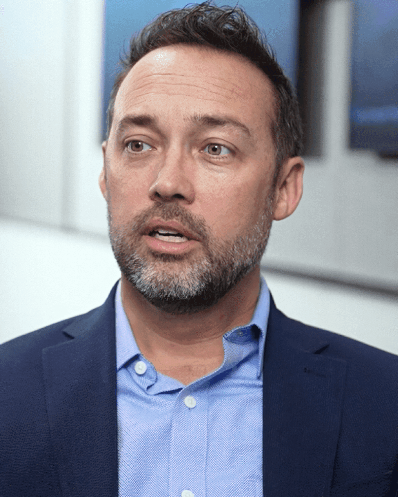 | `HfaLCxdC3xfmlQGeH9kcFsXYnk.png`  | Comparison graphic (1.4MB -- needs visual ID, skipped for size)           |
| 4   |  | `xBqVUrTX51Ag560dM2AzeQGhg.png`   | "White logo on transparent background" (barely visible, hard to identify) |
| 5   |  | `sk3MG8zImcTybJZRLQTHybRcBI.png`  | Comparison graphic (1.4MB -- needs visual ID, skipped for size)           |
| 6   |  | `E28cFQQ3Thz0y0tODm7GpCMNQ4.png`  | "SpotOn logo"                                                             |
| 7   |  | `YuB06E5QQYPr5l0rr28J7C7Fk.png`   | "Rippling logo"                                                           |

---

### Article: AI Tools for Accounting (`/articles/ai-tools-for-accounting`)

**Total images:** ~18 | **Missing alt:** 15 | **With alt:** 3

This article reviews 11 platforms (Maxima, BlackLine, FloQast, Tabs, Zuora, Brex, Ramp, Trullion, Klarity, Pigment, Abacum). The in-article images likely correspond to screenshots or logos of these platforms. **Visually match each image to its platform in Framer.**

| #   | Preview | Framer Filename                    | Suggested Alt Text                                                                                        |
| --- | ------- | ---------------------------------- | --------------------------------------------------------------------------------------------------------- |
| 1   | 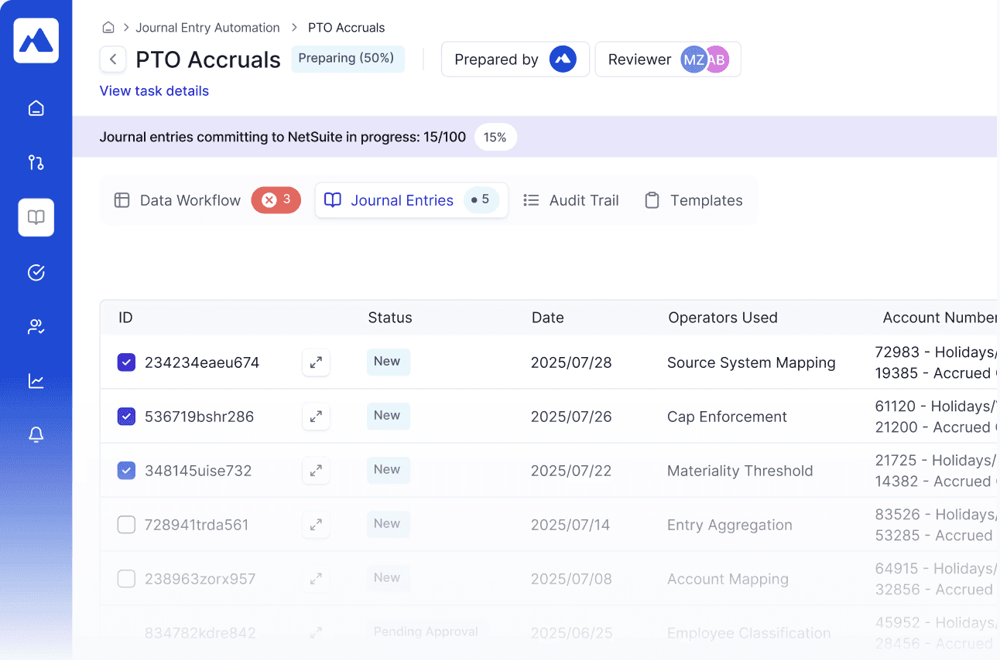 | `R7L9UulqDSwlrgho13ecW7XE.png`     | "Maxima platform screenshot showing PTO Accruals journal entry automation with NetSuite integration"      |
| 2   | 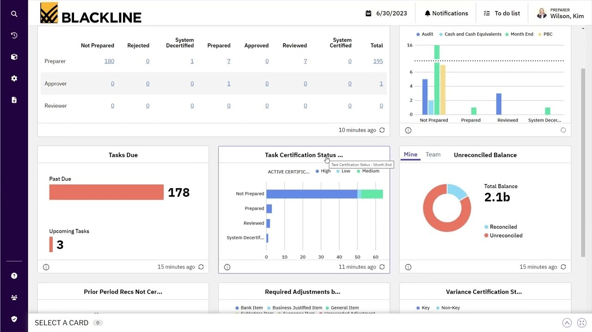 | `f571vQy8CgopN7b1nHR4VtFig.jpg`    | "BlackLine dashboard showing task certification status, unreconciled balances, and tasks due"             |
| 3   | 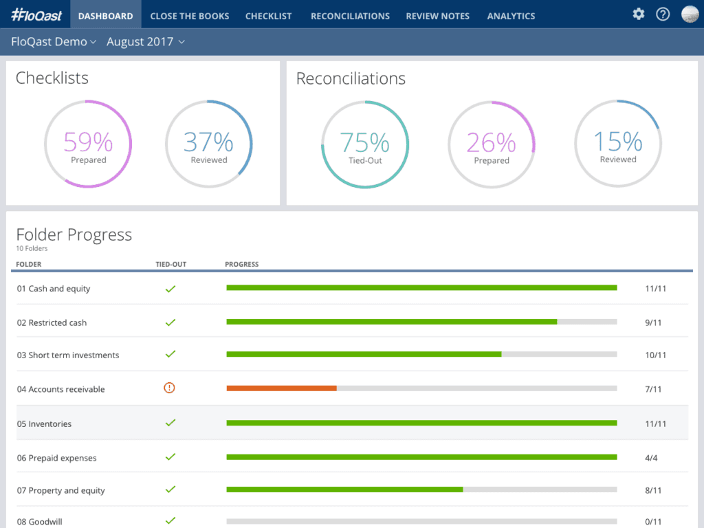 | `UzC6B82Iksh9N8HPr4klrxBBq8o.png`  | "FloQast dashboard showing checklists, reconciliations progress, and folder completion status"            |
| 4   | 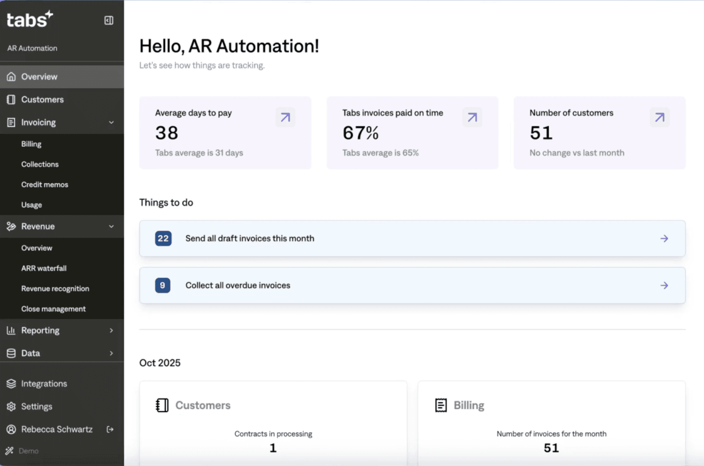 | `8Zgyo3gRtYcZF2zZ2WkKQBcNI.png`    | "Tabs AR Automation dashboard showing average days to pay, invoice metrics, and billing overview"         |
| 5   | 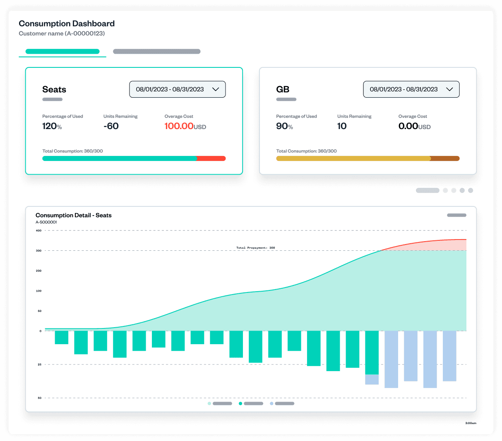 | `vCQIi9K2toANtomgMZyD42Cr7hk.png`  | "Zuora consumption dashboard showing seat usage, GB tracking, and overage costs"                          |
| 6   | 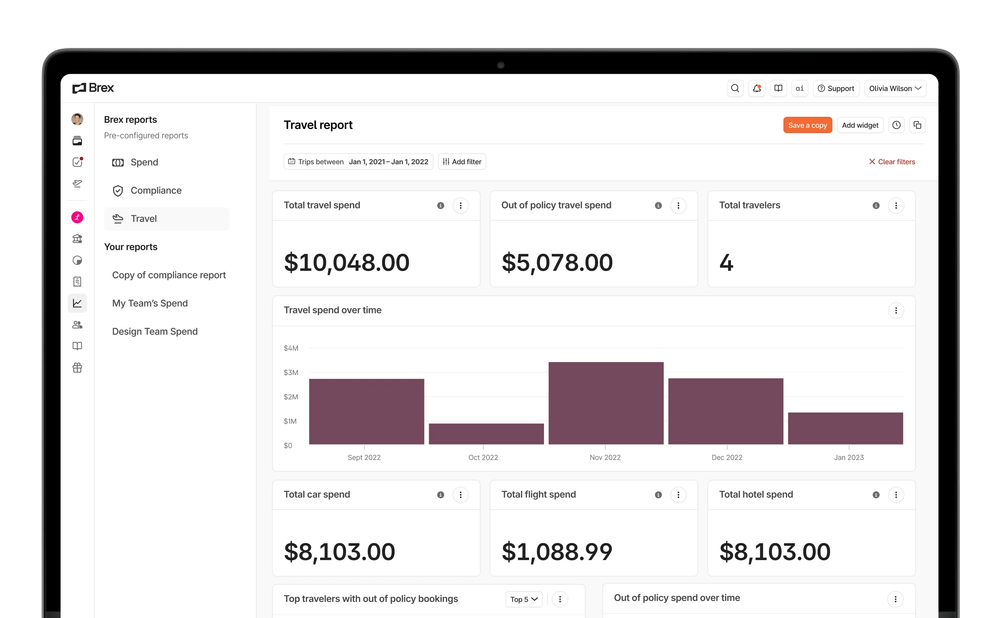 | `iPzE1gzhHfNQrX7oowVeKjxjaOQ.webp` | "Brex reports dashboard showing travel spend, out-of-policy expenses, and monthly spend trends"           |
| 7   | 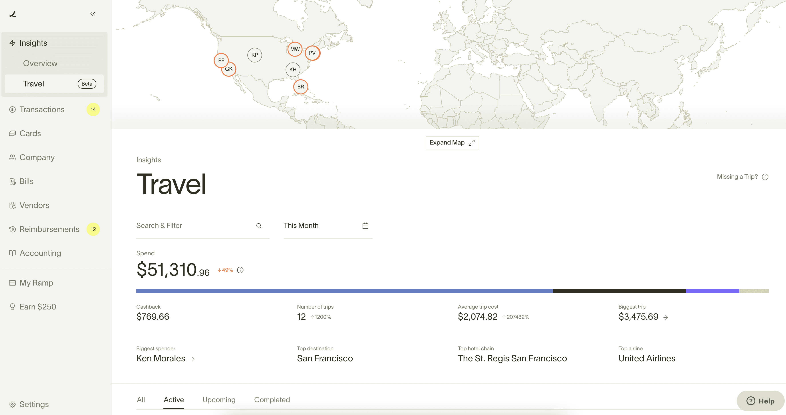 | `3VEzpWFX1ncDEYQR7fGfW3V5SCQ.png`  | "Ramp travel insights dashboard showing spend map, trip details, and expense breakdown"                   |
| 8   | 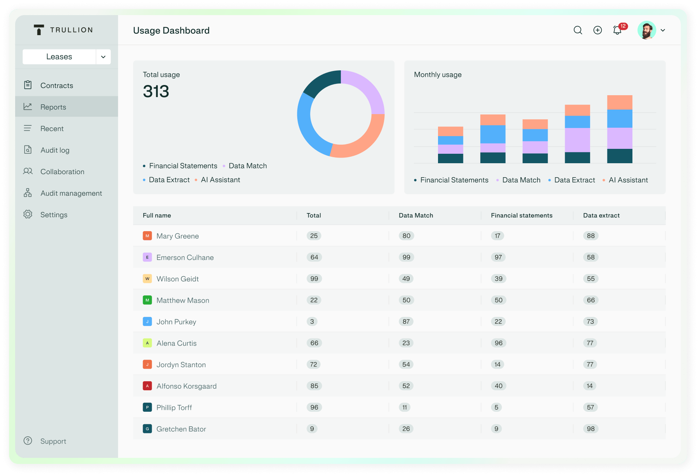 | `PbqTwH8d4iNdMkcToFGfB441VPY.webp` | "Trullion usage dashboard showing total usage, monthly breakdown by category, and user-level activity"    |
| 9   | 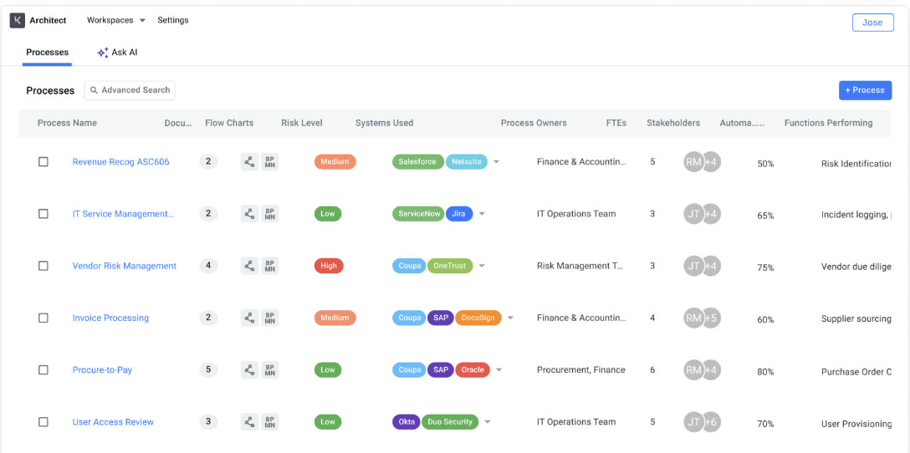 | `4Y3o6CZKEV7aIA2DdmGBZ9X3s.png`    | "Klarity Architect processes view showing risk levels, systems used, and automation percentages"          |
| 10  | 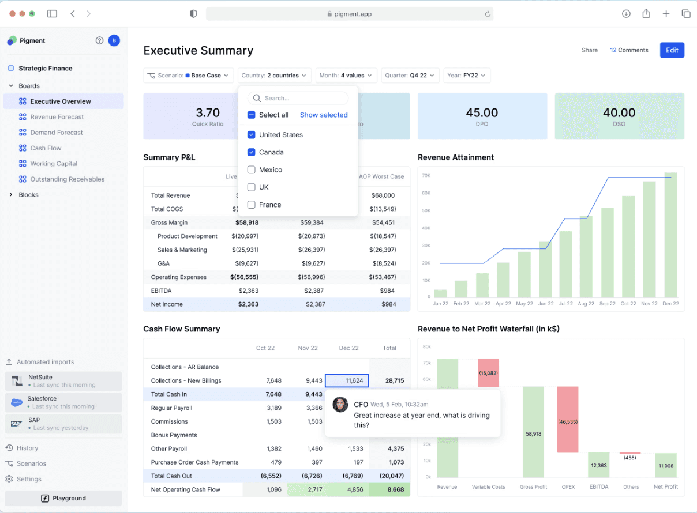 | `mkvJdzhs6WyRPJZbGdQoV0GwUo.png`   | "Pigment executive summary showing revenue attainment, cash flow summary, and net profit waterfall chart" |
| 11  | 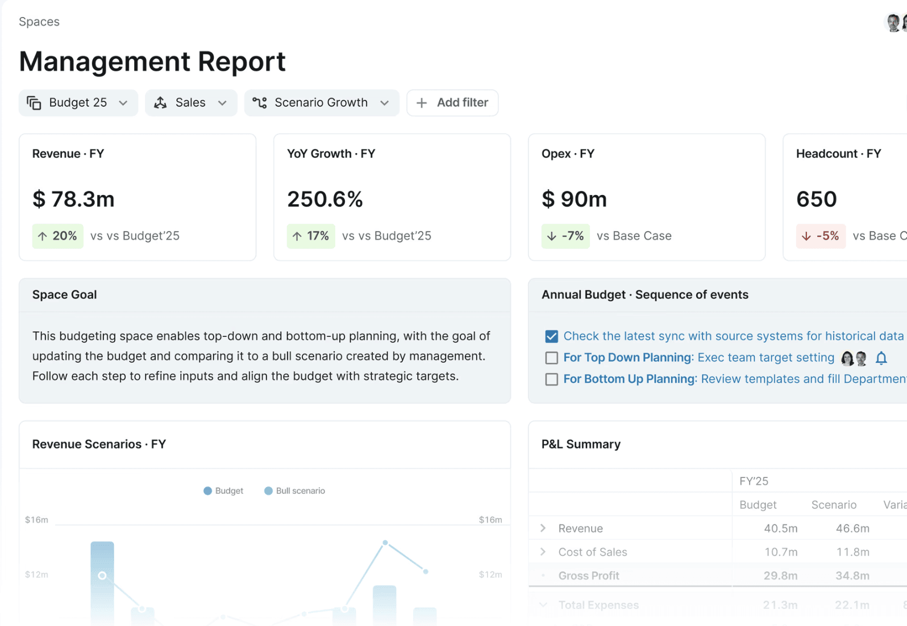 | `8NTuUnklud4HHSVdsP9eSecuEQ.png`   | "Abacum management report showing revenue, YoY growth, opex, headcount, and budget scenario planning"     |

---

### Article: Accuracy in Accounting (`/articles/accuracy-in-accounting-why-ai-needs-more-than-intelligence`)

**Total images:** ~9 | **Missing alt:** 5 | **With alt:** 4

| #   | Preview | Framer Filename                   | Suggested Alt Text                                                                                                                                                                                                                                                                      |
| --- | ------- | --------------------------------- | --------------------------------------------------------------------------------------------------------------------------------------------------------------------------------------------------------------------------------------------------------------------------------------- |
| 1   | 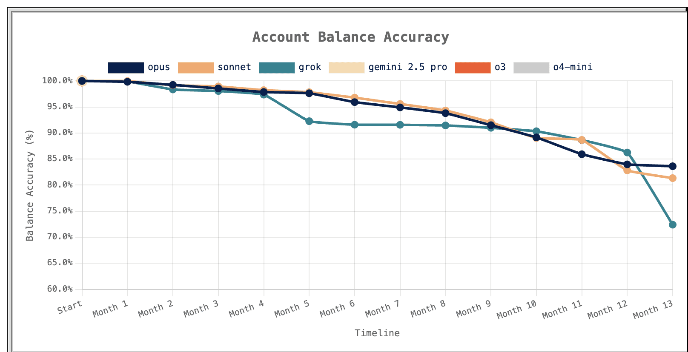 | `3UVdFS4uFQpoDZ00KLKs4Br4HAI.png` | "Account Balance Accuracy chart comparing AI models (Opus, Sonnet, Grok, Gemini, o3, o4-mini) showing accuracy decline over 13 months"                                                                                                                                                  |
| 2   | 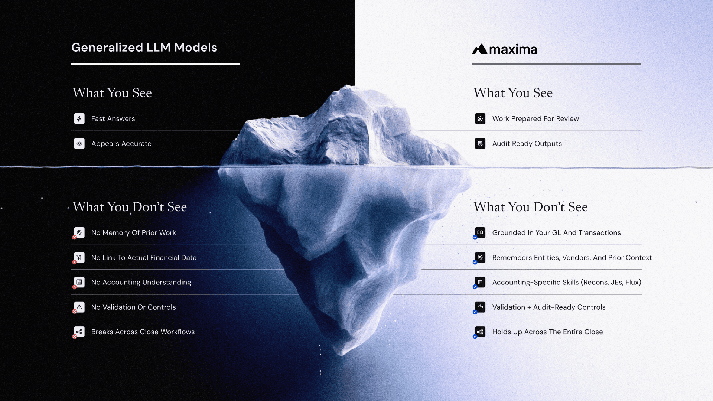 | `vADRg9PkaoVtnP3Nbp7G3QTxqeQ.png` | "Iceberg diagram comparing generalized LLM models vs Maxima: LLMs appear accurate on the surface but lack memory, financial data links, accounting understanding, and validation; Maxima delivers audit-ready outputs grounded in GL data with accounting-specific skills and controls" |

---

### Article: The Office of the CFO in 2030 (`/articles/the-office-of-the-cfo-in-2030-how-ai-agents-change-the-equation`)

**Total images:** ~10 | **Missing alt:** 6 | **With alt:** 4

| #   | Preview | Framer Filename                   | Suggested Alt Text                                                                                                                                                                                               |
| --- | ------- | --------------------------------- | ---------------------------------------------------------------------------------------------------------------------------------------------------------------------------------------------------------------- |
| 1   | 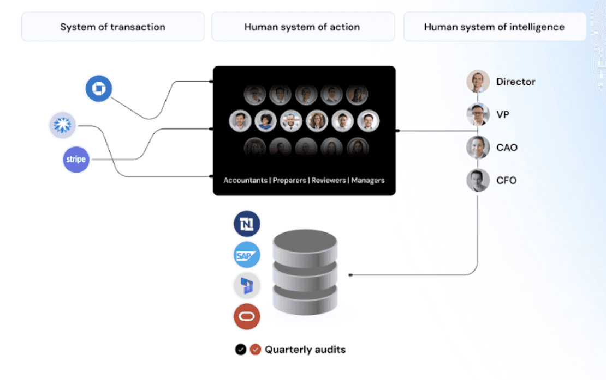 | `VEgoeMjxNcZHyt6gs3u0mnM5du4.png` | "Diagram of traditional CFO office workflow: system of transaction to human system of action (accountants, preparers, reviewers) to human system of intelligence (Director, VP, CAO, CFO) with quarterly audits" |
| 2   | 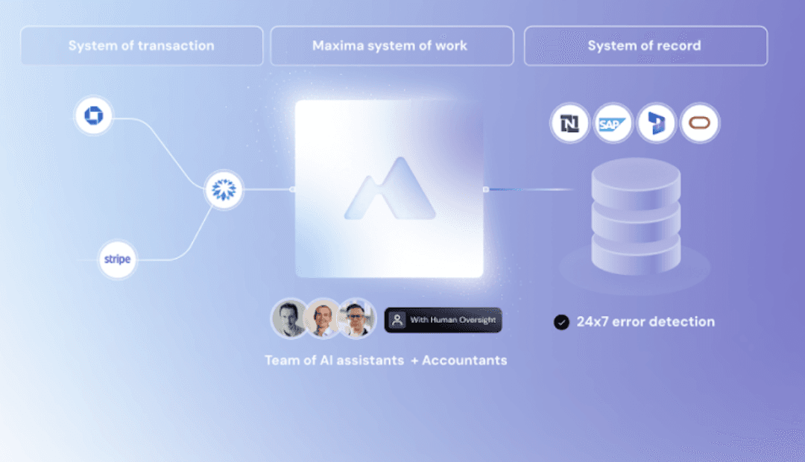 | `eLJiMRSgNORQAVepTBi0336jGk.png`  | "Diagram of Maxima-powered workflow: system of transaction to Maxima system of work with 24/7 error detection and AI assistants alongside accountants to system of record"                                       |
| 3   | 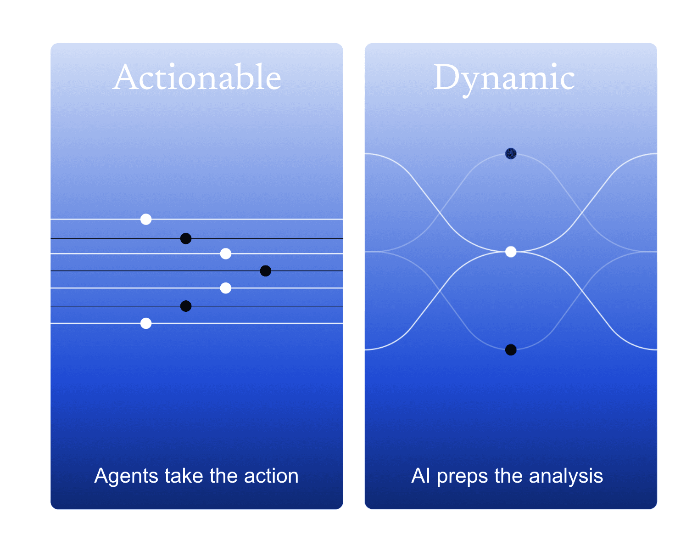 | `mpAqItRV41cXj4GeLRmTfUkJY.png`   | "Two-card illustration comparing Actionable (agents take the action) and Dynamic (AI preps the analysis) capabilities"                                                                                           |

---

### Article: Maxima Seed & Series A (`/articles/maxima-seed-series-a-agentic-ai-accounting`)

**Total images:** ~8 | **Missing alt:** 4 | **With alt:** 4

| #   | Preview | Framer Filename                   | Suggested Alt Text                                                                                                                                                                       |
| --- | ------- | --------------------------------- | ---------------------------------------------------------------------------------------------------------------------------------------------------------------------------------------- |
| 1   | 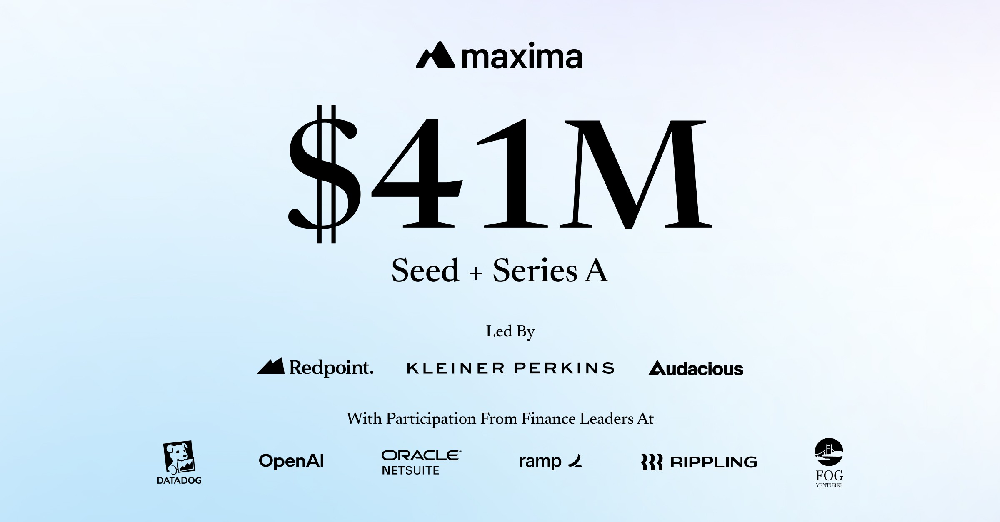 | `bb7hBnvbLl86twSqj0nYm1cBLLU.jpg` | "Maxima $41M Seed and Series A funding announcement, led by Redpoint, Kleiner Perkins, and Audacious, with participation from Datadog, OpenAI, Oracle NetSuite, Ramp, Rippling, and FOG" |

---

### Case Studies (SpotOn, Rewst, Rippling, Gorgias, Scale AI)

All 5 case study articles share the same missing images -- only the shared site-wide template elements. No unique in-article images are missing alt text beyond what's covered in Section 1.

---

### Press/Investor Articles (Reuters, Kleiner Perkins, EY Alumni, BlackLine CMO)

Same pattern as case studies -- only shared template images are missing alt.

---

### Editorial Guides (Variance Analysis, Reconciliations, Financial Close Software)

Same pattern as case studies -- only shared template images are missing alt.

---

### Legal Pages (/legal, /legal/privacy-policy, /legal/terms-of-service, /legal/cookie-policy)

Only shared site-wide decorative images. No unique images.

---

## 3. Summary & Priority

### By fix effort vs. impact

| Priority     | What to fix                                           | Unique images | Pages affected               | Impact                                                     |
| ------------ | ----------------------------------------------------- | ------------- | ---------------------------- | ---------------------------------------------------------- |
| 1 - Critical | 2 site-wide decorative images (add `alt=""`)          | 2             | ALL 30 pages (~60 instances) | Fixes largest batch in one Framer change                   |
| 2 - High     | 30 team headshots on /about page                      | 30            | 1 page                       | Accessibility compliance for team representation           |
| 3 - High     | 11 platform screenshots on AI Tools article           | 11            | 1 page                       | Key buyer guide page -- images are content, not decoration |
| 4 - Medium   | Comparison page images (testimonials, feature icons)  | 12            | 1 page                       | High-traffic comparison page                               |
| 5 - Medium   | Newsroom article thumbnails                           | 6             | 1 page                       | Press coverage visibility                                  |
| 6 - Medium   | Book-a-demo trust badges/logos                        | 4             | 1 page                       | Conversion page                                            |
| 7 - Medium   | Blog listing thumbnails                               | 4             | 1 page                       | Content discovery                                          |
| 8 - Low      | Article in-content illustrations (Accuracy, CFO 2030) | 5             | 2 pages                      | Thought leadership articles                                |
| 9 - Low      | Homepage customer logos                               | 2             | 1 page                       | Customer trust signals                                     |
| 10 - Low     | Fix alt text typos on homepage                        | 2             | 1 page                       | "Ripping" -> "Rippling", remove ".png" from SpotOn alt     |

### Alt text errors on images that DO have alt text

| Page         | Image                             | Current Alt                             | Issue                                | Fix                                   |
| ------------ | --------------------------------- | --------------------------------------- | ------------------------------------ | ------------------------------------- |
| / (homepage) | `2xO5dPLiVpqVAWReKw5iab9Cl8.png`  | "Vipin Sethi, Controller at Ripping"    | Typo: "Ripping" should be "Rippling" | "Vipin Sethi, Controller at Rippling" |
| / (homepage) | `bueD7XevgiYiqgzab1SBd6kaRsQ.png` | "Jack Chalfant, Controller, SpotOn.png" | ".png" file extension in alt text    | "Jack Chalfant, Controller, SpotOn"   |

### Total count

| Category                                     | Count |
| -------------------------------------------- | ----- |
| Unique images needing alt text               | 83    |
| Images that should get `alt=""` (decorative) | ~8    |
| Images that need descriptive alt text        | ~75   |
| Images with alt text errors (typos)          | 2     |
| Total instances across all pages             | ~170  |

---

*Report generated from Ahrefs Site Audit data and raw HTML extraction (April 14, 2026).*